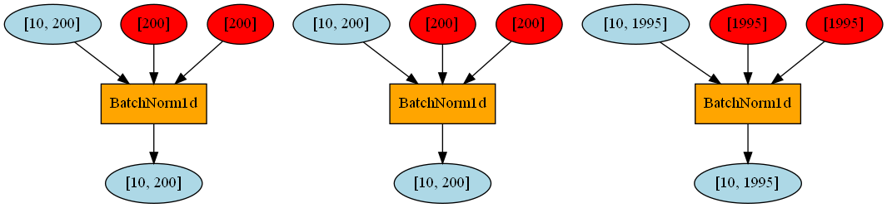

# PyTorch Implementation of Autoencoding Variational Inference for Topic Models
Much of the code is adapted from the sourced pytorch repo there.

[Original Paper](https://arxiv.org/abs/1703.01488). 
[Original Tensorflow implementation](https://github.com/akashgit/autoencoding_vi_for_topic_models).
[Sourced Original Pytorch Implementation](https://github.com/hyqneuron/pytorch-avitm)

What this repo contains:
- `pytorch_run.py`: PyTorch code for training, testing and visualizing AVITM
- `pytorch_model.py`: PyTorch code for ProdLDA
- `pytorch_visualize.py`: code for PyTorch graph visualization
- `tf_run.py`: Tensorflow code for training and testing AVITM, entirely copied from source repo.
- `tf_model.py`: Tensorflow code for ProdLDA, adapted from source repo.
- `data` folder: 20Newsgroup dataset, entirely copied from source repo.

Note that the tensorflow implementation prints the topic words first, then has to wait a few seconds to print the
perplexity, as testing right now isn't parallelized.

Also note that within the sample results provided (10_topic_hypernetwork and OriginalProdLDA), there is a vocab index fixer file present.
This is due to the code that was used to run the experiments having an error in indexing for printing the top words.
The running code has been fixed, but it's just left there as a record, since the older results needs that code to move it to the right indexes for printing.

Finally, the actual dataset has 9 topics but we test on 10.
We also run 80 epochs. (you don't need 80 epochs for the hypernetwork version actually. around 20 is also not going to improve performance.)

# Running the code
- Run it with pytorch_run.py.
    - The pytorch code has been upgraded to torch 1.10
    - It is tested on torch 1.10.0+cu113.
- The test models here use transformers=4.20.1
- A requirements.txt has been provided.
- The PHEME dataset is also included in this Repository.
- A change has been made to the model. 
    - BN's scale parameters are restored. The code can't run if the weight parameters for batch norms are None.
    - self.logvar_bn
    - self.mean_bn
    - self.decoder_bn
    - self.decoder_bn
    - Only applies to ProdLDA model.
- The code will output the following:
    - A topwords file.
    - The models at every epoch.
- The pytorch implementation has an association dictionary that is not in the original implementation in tensorflow.
    - It's unknown why. but it looks to be filtering the outputs to make them.. prettier?

# PyTorch Graph visualization

Red nodes are weights, orange ones operations, and blue ones variables. Input at top, output at bottom.

# Tensorflow Graph visualization

Visualization with Tensorboard. Gives a better high-level overview. Note input is at the bottom, and output is at the
top.

